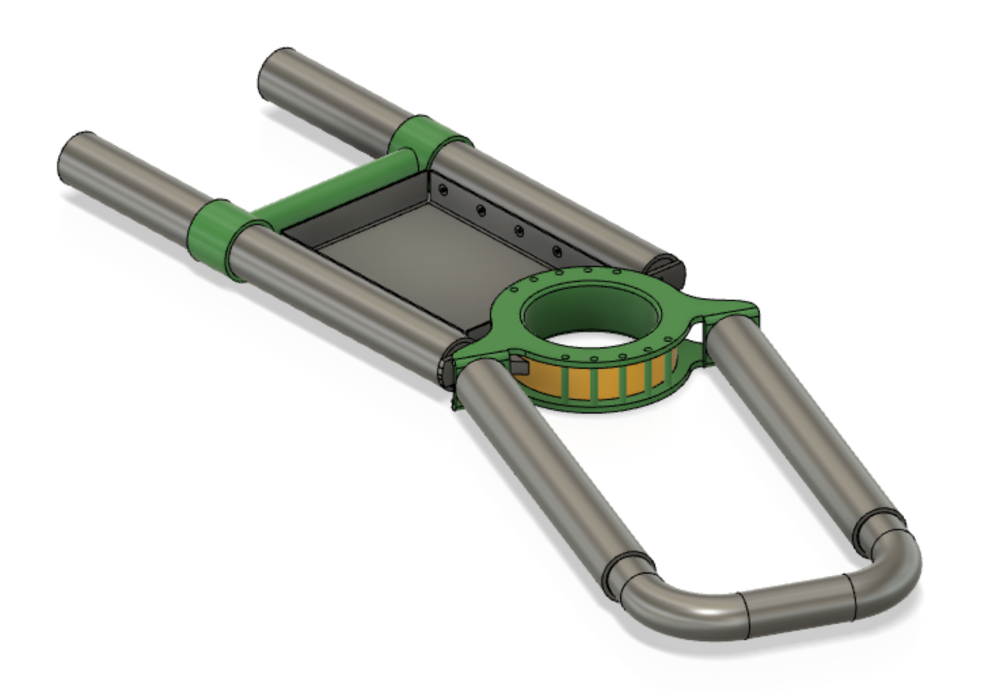

# 110 - Frame

>

<!-- tbd. remove the front tray from the picture -->
<!-- tbd. picture lacks the motor for central hub (not yet designed) -->

The frame is the backbone of the vehicle platform. It conveys the forces from the wheels to the cabin. 

## Terminology

- *beam* = pipe part in direction of the rails
- *central hub* = the rotary part between the front and end parts

## Design notes

### Ribs help spread the load

In addition to this structure, there may also be "ribs" that help support the cabin (these are MVP 0.2). They will help avoid a bend of the frame by passing cabin weight directly to the beams, not only via the central hub.

However, if we design the frame to be sturdy enough, such additional features will only help.

## Concerns

*Add concerns here*

## Specs

|Spec id||
|---|---|
|`TURN(3m)`|turns down to 3m radius|
|`STIFF`|central hub is stiff/strong enough to take pushing force from back wheels, without turning|
|`BEND(Xmm)`|central hub, or beams, may not bend more than X mm (not decided)|
|`TWIST(F,d)`|with force F applied between a front beam and an opposite back beam, twist may be at most d|

## Test cases

### One side

*Presents a load scenario when riding on one-side track*

Apply upward support in the place of wheel on the left side (two locations). Apply downward force (3000 N) at the hub.

Bend between front and back beams must be below X mm.

### Both sides

*Presents a load scenario when riding rails on both sides*

(can be ignored; will pass is one side test passed)

## Parts

- 111 - Beams
- 112 - Central Hub

Next: [111 - Beams](111-beams.md)
