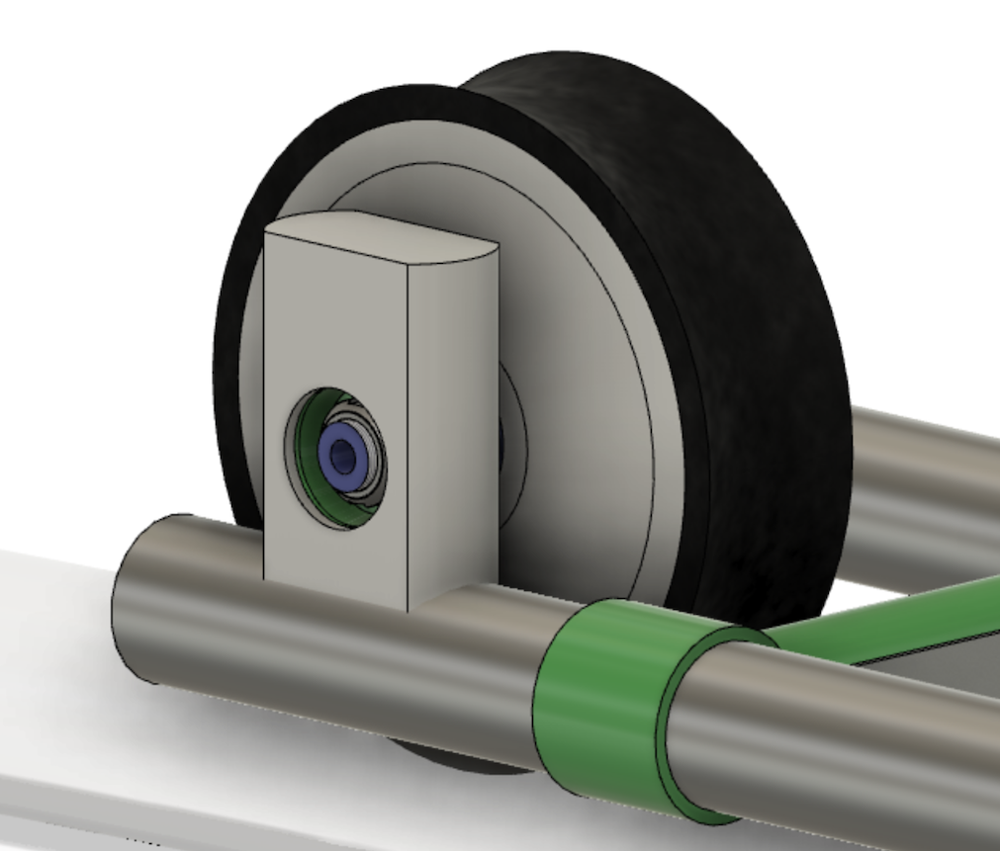

# 120 - Wheel + mount

>

Within MVP 0.1, the wheel mounts do not move, relative to the beams. This is a simple setup and enough to tune the suspension part correctly.

The wheel + mount:

- provides structural rigidity, passing the vehicle's weight to the track
- provides passive suspension (up/down), against minor height variations in the track

## Goals

- Prepare for 40 km/h speed (affects motor selection)[^1]
- Both front and rear wheels are motorized. 

   Note that this is not an absolute goal. We can e.g. use wheels of different size (at some point), where one (rear) would be more in charge of actual power output. But for MVP 0.1 the goal is to have "all wheel drive".

[^1]: We're likely not going to be travelling this fast, with MVP 0.1. It makes sense to have a realistic goal though, lest we pick too flimsy motors and end up correcting the choice, later.

The wheel do not turn. 

In fact, studying how much turning torque running with this arrangement gives could be one of the studied from MVP 0.1.

### Wheel motor

The wheel envisioned for the prototype is a [GEM Motors 1.1](https://gemmotors.si/products) - 24cm diameter European wheel motor.

Different wheels can be used - as long as the suspension takes care of their size differences and other details. This is why we regard the wheel + mount as a single design module (mount is an adapter part).

Proving the suitability of GEM 1.1 to the task is a goal.

### Tire

The plan is to make a custom tire (we need concave profile). Testing the feasibility of this and its performance is part of MVP 0.1.

## Design notes (MVP 0.1)

Simplicity is paramount. With this design, we plan to learn about the realm in order to improve it in MVP 0.2.

- How can the suspension best be attached to the beam?
- Do we need suspension / how much?
- Does the suggested (self made) suspension work?
- How much forces (torques, vibrations) does a running motor provide?
- Is the selected motor good for us?
- How easy is the motor to control?
- Study if tilting the suspension (e.g. 5°, 10°, 15°) is better for features than the proposed vertical orientation

There isn't a dedicated controller in the PBS for the wheel. The idea is that we just provide power and run some signal lines. We'll see if that is enough (we need: set target speed, get event when target speed is reached, get current speed).

Attaching the suspension to the beam is considered a manual step (read: angle grinder! 💫⚡️). We don't really need to optimize that, as long as it's a rigid connection. Use auxiliary pipes, if necessary (slide some inside the beams, like the central hub `#112` does, if necessary).

>Hint: You noticed the mention about tilting angles. Maybe the attachment can have multiple bolt holes and allows for easy change of angles?

There are `#122-000[a-d]` parts marked in the PBS but these may or may not be needed.

<!-- Editor's choice: bloat :)
>Side note: Height of the beams over the track is designed by this module. There is no requirement, except being slightly (1cm is enough) above the rails. Obviously, low center of gravity is better than high.[^2]

[^2]: It is not completely true that the height wouldn't matter. It matters to the grabber arms (part of MVP 0.2), so they find the side rails.
-->

Suspension's top is allowed to raise up to the level of the wheel, but if possible (as in the picture), it's better to leave it lower. The space of the front wheels is near passengers' legroom and we might end up with space constraints here, later in the project.

## Options

The wheel size can be anything (that would take the vehicle min 40 km/h, as stated).

Tilting the suspension (at a slight angle, e.g. 10° away from vertical), in the direction of the front facing movement is possible. There will, however, remain a requirement to be able to reverse the vehicles, but the comfort doesn't need to be as good and speed may be less than forward facing speed.

In MVP 0.2, we'll need to be able to raise the wheels a bit (1..2cm), for crossing rails. The amount comes from the curvature of the tire's concave. If this is possible within the suspension system (adding active components to it), great. If not, we'll look for other ways to do it.

Suspension can be active. Within MVP 0.1 we should learn, how well passive suspension would work. If it does, it may make control systems simpler, being able to think the track is flat underneath. It is crucial for the overall project that the track is nimble - and that makes it flexible. How we handle that flexibility is up to us - suggestions are welcome but likely we just need to try it out and learn. Lots.

## Concerns

*Add concerns here*

## Specs

|Spec id||
|---|---|
|`SPEED(11 m/s)`|wheels can spin 11m/s (40 km/h)|
|`STIFF`|vibrations and torques from the running motor (at full `SPEED`) don't cause problems for the frame (considering by passenger comfort but also accuracy of grabber arms)|
|`SUSPENSION`|suspension can smooth out a range of vibrations. One sample can be 1cm/1s sine-lift(*), which should be more or less supressed| 

(*) emulating support poles every 10m, speed 10m/s, where poles give more support than track in between them

## Test cases

later

## Parts

- 121 - Suspension (and wheel)
- 122 - Connection to beam

Next: [121 - Suspension](./121-suspension.md)
