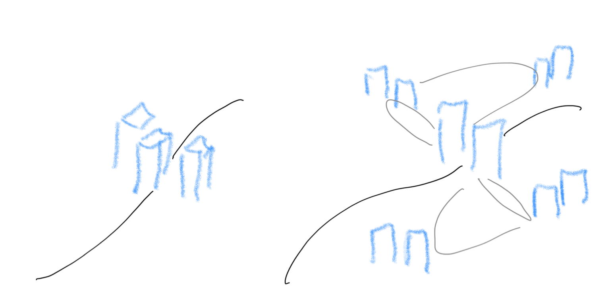
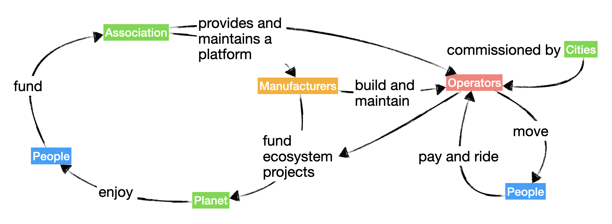

# Kotka - a platform for ultra light rail

Making of a 21st century vehicle platform:

- capable of transporting 2-3 people (240kg)
- running on a rail, in the air
- speeds ~40..70 km/h
- buildable by readily available or easily manufacturable parts
- easily fixable
- fully "transparent"(*) to the nature

>(*) Zero carbon footprint, low ground footprint, low noise and illumination footprint, fully recyclable track, stations and vehicle components.

## Short history of PRT

This mode of transport is called "PRT" or Personal Rail Transit, by some. It could be an electric solution for what traffic planners call "feeder systems" - ways for people to reach the metro/rail/subway station. It can also be used as a "community metro" for populations as low as 20 000 people, or a campus track for universities, hospitals or company campuses.

If cheap, reliable and comfortable to ride, such an offering could transform 2020's transportation planning. Maybe even city planning, since instead of building high-rises near the stations, the reach of PRT would allow people to live further apart from the station (in distance), yet equally close in time.

🍌

>

*Figure 1. Less this; more that.*

<!-- Editor's note: tbd. better picture one day #help -->

Since the tracks are above the ground ("off grade" in transport planner parlance), the tracks don't cause hindrance to other transport in the way that roads or trams do. You can walk, bicycle or drive below them.

## Who should build it?

PRT's have been around. It's never "flown" commercially so either it's not possible, or the models used earlier have been missing something. The deal is to get this into transport planning *mainstream* - to make it a hard-to-pass reality that customers (cities) ask of the planners. That, again, needs citizens to be aware so they know about the possibility. 😊

The model taken here is to JUST HACK IT!!

Aim for this stage is to make a working proof of concept that shows the potential. Making it out in the open so that people with various skills (CAD, electronics, mechanics, pneumatics, embedded software, cloud software, PR, video production) can contribute.

Making it FUN. For the makers. For the backers. For the general audience.

Let's ROLL! 

## CAD Model

🍌

Asko (the founder) made an initial model in 2019, but something went wrong. It's not supposed to look like this:[Fusion 360 project](https://a360.co/2sn1Wej)

>

Learning from the mistakes, a new start was made in 2020.

This time, the models are spread over multiple Fusion 360 projects. Having everything in a single "file" turned out to be making things harder and harder to fix (and easier and easier to break).

>

That's better.

>Note: This image lacks crucial elements and is outdated. But it shows a minimum set of components that can be designed, assembled, tested and iterated upon.

## PBS and the CAD designs

There is a Product Breakdown System for numbering the parts and keeping track of their maturity.

The CAD files are available in Fusion 360, for people wanting to help and agreeing to the license terms.

This repo aims at being a narrative for the CAD models, discussing decisions behind them, alternatives not taken, pros, cons, design criteria. Anything we cannot place in the CAD models, themselves.

We provide:

- Access to the PBS sheet, per request
- Access to the CAD files, per request
- [ ] tbd. chat. Should we use Gitter, Discourse or what??

<!--
- [GitHub Issues](link tbd.), for raising concerns, ideas, and tracking the progress of individual designs
-->

>Note: The Marble Music Machine project by [Wintergatan](https://www.patreon.com/m/687732) (Patreon) / Martin Molin has been a strong inspiration for how to orchestrate this effort. You'll do well checking his project out! :)

## Collaboration

### Forums

*This area is work-in-progress. Expect meaningful forums by summer 2020.*

For now, you can reach the author on Twitter: [askokauppi](https://twitter.com/askokauppi)

<!-- disabled until we get the org up!

- The org would have its own (main) GitHub project and this as another.
- The org would have email etc. outside communications

- What chatting forum?
   - to be discussed, within the org (Gitter, Discourse, ...?)

The list below is about the larger association:

|tool|details|usage|
|---|---|---|
|gitter|(to be opened)|daily flowing stuff|
|GitHub|(to be opened)|version control|
|Google Docs/Sheets/Slides|(to be opened)|internal documents|
|Google Meet (now free!! May 2020)|(to be opened)|conference calls|

CAD specific:

|tool|details|usage|
|---|---|---|
|gitter|(to be opened)|daily flowing stuff|
|GitHub|(to be opened)|version control|
|GitHub Issues|(to be opened)|roadmap, ideas etc.|
|Fusion 360|(to be opened)|CAD collaboration|

In addition, the hosting ...(organization name)... has its own, internal forums.
-->

### License

The CAD models are proprietary (copyright Asko Kauppi), for now.

The content is likely to be released as [CC BY-NC-SA 4.0](https://creativecommons.org/licenses/by-nc-sa/4.0/deed.en) but this **has not been decided, yet** (Apr 2020). If you have opinions about the licensing, please be in touch.

The purpose of the effort is to lay an open source foundation, upon which companies could build their implementations.

### Commercial Licensees

There will be burdens for such commercial implementations. They can e.g. be required to contribute X % of their profits, or Y % of their revenue (whichever is higher) to a biodiversity restoration / protection program, approved by the Association.

The Association might not need to be funded by the companies benefiting from its work. This should help keep it relatively unbiased, and being able to focus on technical prowess instead of chacing market demands, which would happen if companies gained undue influence.

*Business models involved[source](https://www.icloud.com/keynote/0_tgC79crlpnkV4GVsyR2xs_A#Outstanding_-_association_business_model)*

This makes a win-win-win out of the deal. Details need to be crafted and detailed, once we get there. But it's not going to be an unlimited free ride for corporations, either.

## References

- [How to Organize Your Project with a PBS system - Marble Machine X #57](https://www.youtube.com/watch?v=zVyEsMiwvVc) (Youtube Oct 2018; 18:27)

---

Next: [PBS](./PBS.md)

