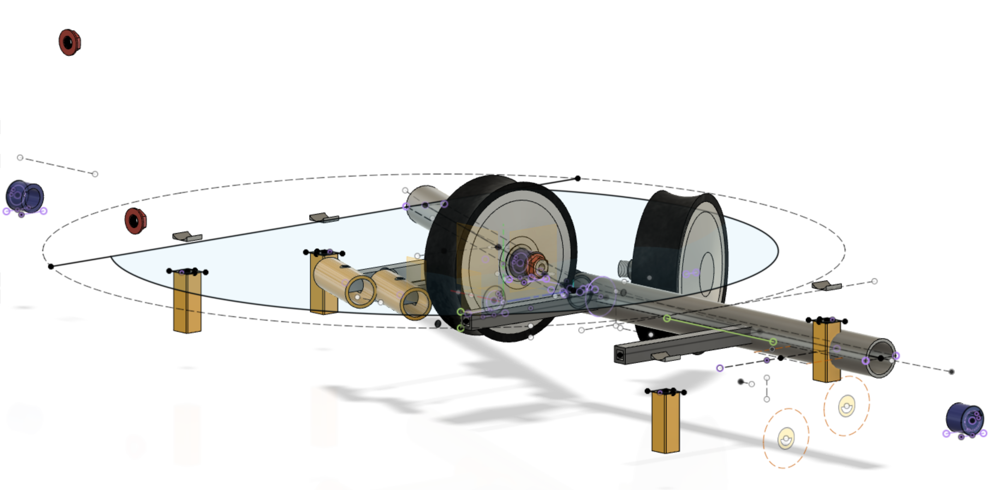

# AirBorn

Making of a Fusion 360 CAD project, to have a vehicle platform

- capable of transporting 2,5 people (240kg)
- running on a round rail, in the air
- speeds ~40..70 km/h
- buildable by readily available parts (easily fixable)

This is "PRT" or Personal Rail Transit. It could be an electric solution for what traffic planners call "feeder systems" - ways for people to reach the metro/rail/subway station.

If cheap, reliable and comfortable to ride, such an offering could transform 2020's transportation planning. Maybe even city planning, since instead of building high-rises near the stations, the reach of PRT would allow people to live further apart from the station (in distance), yet equally close in time.

🍌

>

*Figure 1. Less this; more that.*

Since the tracks are above the ground ("off grade" in transport planner parlance), the tracks don't cause hindrance to other transport in the way that roads or trams do. You can walk, bicycle or drive below them.

## Who should build it?

PRT's have been around. It's never "flown" commercially so either it's not possible, or the models used earlier have been missing something. The deal is to get this into transport planning *mainstream* - to make it a hard-to-pass reality that customers (cities) ask of the planners. That, again, needs citizens to be aware so they know about the possibility. 😊

The model taken here is to JUST HACK IT!!

Aim for this stage is to make a working proof of concept that shows the potential. Making it out in the open so that people with various skills (CAD, electronics, mechanics, pneumatics, embedded software, cloud software, PR, video production) can contribute.

Making it FUN. For the makers. For the backers. For the general audience.

Let's ROLL! 

## CAD Model

🍌

Asko (the founder) made an initial model in 2019, but something went wrong. It's not supposed to look like this:[Fusion 360 project](https://a360.co/2sn1Wej)

>

Learning from the mistakes, a new start was made in 2020.

This time, the models are spread over multiple Fusion 360 projects. Having everything in a single "file" turned out to be making things harder and harder to fix (and easier and easier to break).

>

That's better.

>Note: This image lacks crucial elements like the grabber arms. But it's a minimum set of components that can be designed, assembled, tested and iterated upon.

The components will be brought into a [PBS](https://docs.google.com/spreadsheets/d/1G5YIdf7PlUv7BphEBALlFeB5Ye0DMoW4dylRe6NaBZk)[^1-pbs] (Google Sheets) so we get recipies, building instructions etc. right.

[^1-pbs]: Product Breakdown System

## Collaboration

### Forums

<!-- tbd. The list below is about the larger association. We can go CAD specific here

|tool|details|usage|
|---|---|---|
|gitter|(to be opened)|daily flowing stuff|
|GitHub|(to be opened)|version control|
|Google Docs/Sheets/Slides|(to be opened)|internal documents|
|Google Hangouts Chat|(to be opened)|conference calls|
|Fusion 360|(to be opened)|CAD collaboration|
|email|(to be opened)|communications outside the org|
-->

|tool|details|usage|
|---|---|---|
|gitter|(to be opened)|daily flowing stuff|
|GitHub|(to be opened)|version control|
|Fusion 360|(to be opened)|CAD collaboration|

<!-- tbd.
In addition, the hosting ...(organization name)... has its own, internal forums.
-->

<!-- tbd.
- once the association is up:
  - [ ] open the Google account
  - [ ] open the GitHub account and transport files
-->

### License

The CAD models are proprietary, for now. If you want to participate in working with them, please take contact with Twitter:askokauppi.

<!-- hidden
The content is likely to be released as [CC-BY-SA-NC](https://creativecommons.org/licenses/by-nc-sa/3.0/) but this **has not been decided, yet** (Apr 2020). 
-->

If you have opinions about the licensing, please be in touch.

## References

- [How to Organize Your Project with a PBS system - Marble Machine X #57](https://www.youtube.com/watch?v=zVyEsMiwvVc) (Youtube Oct 2018; 18:27)

---

We are introducing each of the components as a blog post. 

First up is [Sledge Frame](Sledge Frame.md)

