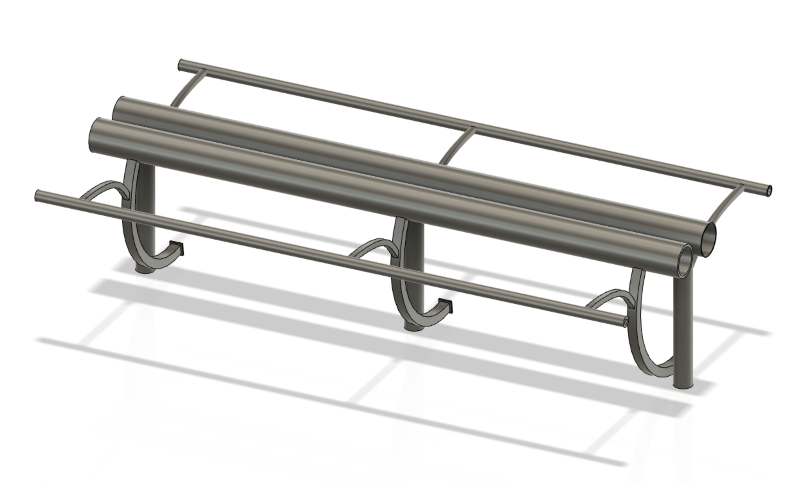

# 540 - Tracks

>

Purpose:

- support the vehicle platform, while being studied / repaired / tested
- allow one track to "disappear", emulating track switching

## Design

The back track is stationary, and provides a rigid connection to the wheel arcs (also attaching them to each other).

The front track can be lowered (manually), to emulate riding on one track or switching tracks.

<!-- tbd. picture of scissor in action: up, low -->

### Side rails (MVP 0.1) are for vehicle platform MVP 0.2

The side rails are not used by the vehicle platform MVP 0.1 (it does not have grabber arms #180). However, it would likely be best to do them already now. The end result of MVP 0.1 is then fully usable for testing vehicle platform MVP 0.2, from day 1.

## Requirements

- One person can operate the lowering / raising of the front track
- The front track has a locking mechanism, so it does not come loose on its own - regardless of rotation of the wheels
- Lowering the front track must not move it sideways: there may be (and will be!) other track segments connecting on left/right.

## Options

## Implementation

## Specs

Track dimensions are eventually to be defined separately (Track #200). Both the vehicle, this component and any track using components (track itself, stations) will need those.

<!--
|Spec id|value|comment|
|---|---|---|
|`TRACK GAP DEPTH`|X mm|the front and back tracks shall not meet until this much below|
-->

## Concerns

## Further designs (MVP 0.2)

The ends of the tracks are envisioned to be continued left/right with other track segments. This, however, is a MVP 0.2 feature. Locking tracks together is left as an exercise for that time.

